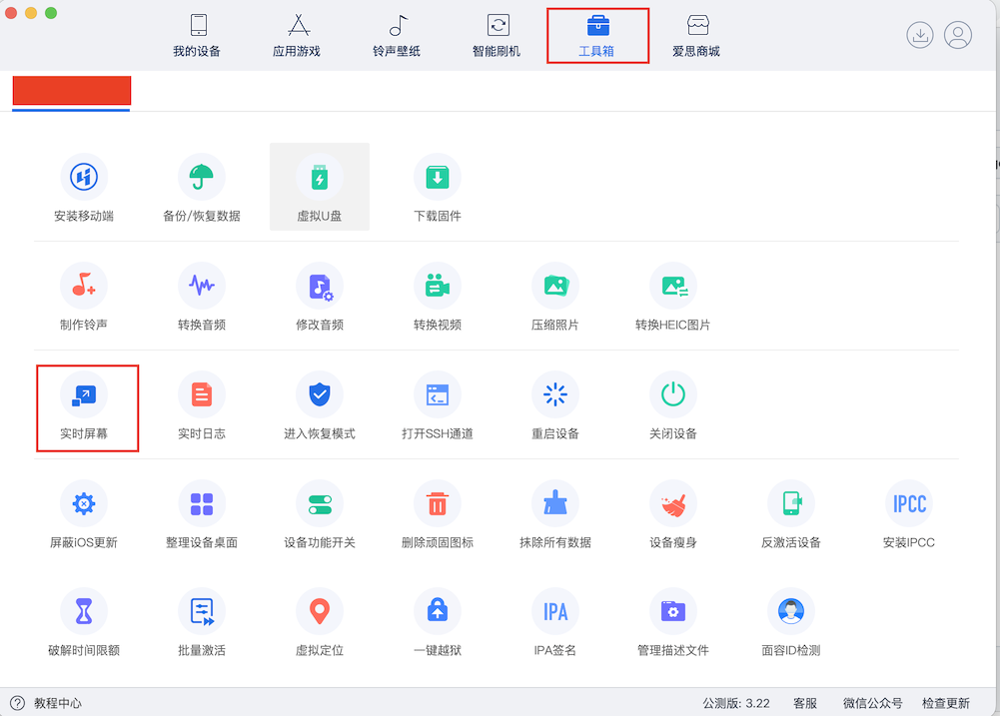
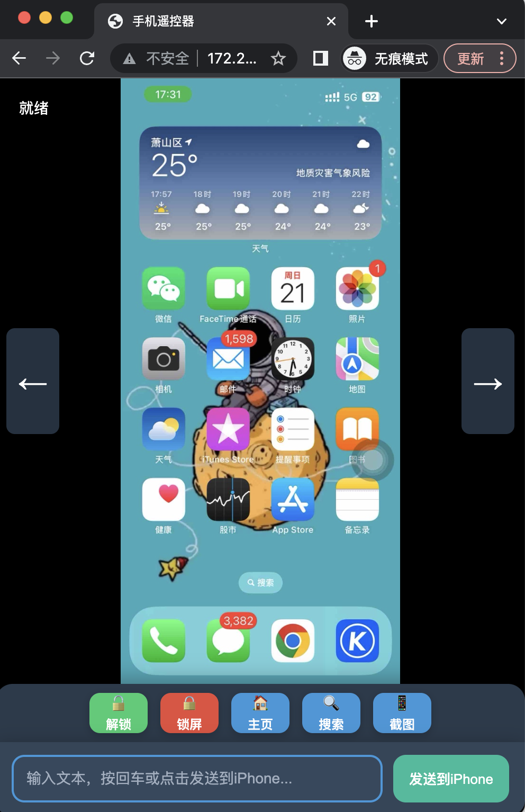

🌐 English | [中文](README.md)

# 🚀 WDA-Runner Cross-Platform UI Automation Testing Tool

> **Supported Platforms**: Windows, macOS, iPhone, Android, Ubuntu, and any device with a browser installed
> 
> **iOS Version**: iOS13 ~ iOS26
> 
> **Features**: UI Automation Testing / Control iPhone testing within local network

---

## 📅 Version Changelog

### November 04, 2025
- 🎯 Improved mouse scroll functionality
- ⌨️ Enhanced keyboard input with monitoring for better user experience

---

## 📖 User Guide

### ⚠️ Important Notes
- IPA package is not signed and cannot be directly installed via tools like i4 Tools
- If you encounter "Installation package verification failed" error, please follow the steps below
- There are 2 installation methods to choose from

#### 1.	Using [WDAInstaller.dmg](https://github.com/ado2023-oss/WDA-Runner/releases/download/1.1.0/WDAInstaller_MacOSV1.1.0.dmg) Tool，[Windows Version](https://github.com/ado2023-oss/WDA-Runner/releases/download/1.1.0/WDAInstaller_WindowsV1.1.0.zip)
- After installation, a 🔧 icon will appear in the Mac menu status bar. (You may need to allow WDAInstaller in System Settings > Privacy & Security to run it.)
	
- Select the latest version from GitHub releases (Windows version is under development and will be available soon)

- Open WDAInstaller and enter your Apple ID and password to log in **(⚠️⚠️⚠️ Strongly recommend creating a new Apple ID for signing, May revoke your existing certificates ⚠️⚠️⚠️)**
- For the Windows version, after entering your account password, the installation should complete in about 1 minute. If there's no response, try unplugging and reconnecting your phone's USB cable, then attempt the installation again.

- Click 'Install WDA-Runner' and wait for the installation progress to appear on your phone

- Open WDA-Runner app, you may see "Untrusted App" warning

- Go to Phone Settings → General → VPN & Device Management

- Select your Apple ID and click "Trust App"

- The app should now open normally

#### ⚠️Important Warnings:

- This method uses personal Apple ID for free 7-day signature

- The app will expire after 7 days and requires re-signing

- ⚠️⚠️⚠️ Strongly recommend creating a new Apple ID for signing ⚠️⚠️⚠️

- Official Apple ID registration: https://account.apple.com/account

- While WDAInstaller doesn't collect your account information, it sends data to Apple to generate certificates and profiles

- This may affect existing developer accounts under your Apple ID

- ⚠️⚠️⚠️ May revoke your existing certificates ⚠️⚠️⚠️

- You are responsible for any losses caused by certificate revocation due to operational errors!


#### 2.	For Professional Developers with Developer Accounts：
##### If you have your own developer account and want to avoid 7-day expiration:


##### For Apple Silicon Mac：
```bash 
git clone https://github.com/ado2023-oss/WDA-Runner
cd WDA-Runner
chmox +x resign_binary
resign_binary -cert 'Apple Development: xxx' -profile 'xxxx.mobileprovision' -os '18'
```
Parameters: certificate name - provisioning profile path - iOS version

##### For Intel Mac：
```bash 
git clone https://github.com/ado2023-oss/WDA-Runner
cd WDA-Runner
chmox +x resign_intel
resign_intel -cert 'Apple Development: xxx' -profile 'xxxx.mobileprovision' -os '18'
```


### TrollStore Users - Use Dedicated Version!
- Some TrollStore users may experience app crashes after installation. Based on testing, you need to:

- Download the computer version of i4 Tools

- Use the "Real-time Screen" tool in the toolbox

- Wait for the screen to display, then the app should work normally!


	
##Using the App
- Open the mobile app and start the service

- After service starts, access: http://xx.xx.xx.xx:47000/live to control your phone


### Example Screenshots


	
Demo Videos::
	
### 
```bash
https://v.douyin.com/_j4gah-vqao/
```
### youtube:: 
```bash
https://youtube.com/shorts/Dz0HmWH1ZFI?si=Ox7YPAl5GfyDcvgG
```
	
### Additional Notes: 
#### Wireless Access Performance,
- Wireless access may experience lag, especially in complex network environments

- Requires bandwidth of at least 2MB/s for stable access
#### Wired Access via USB Cable：
#### Mac Users：
```bash
-- Install homebrew (open terminal)
/bin/bash -c "$(curl -fsSL https://raw.githubusercontent.com/Homebrew/install/HEAD/install.sh)"
-- Install libimobiledevice
brew install libimobiledevice
-- After installing brew and libimobiledevice, open 2 terminals and run
-- Terminal 1:
iproxy 47000 47000
-- Terminal 2
iproxy 47001 47001
-- Finally, open in browser:
http://127.0.0.1:47000/live
```
#### Windows Users：
```bash
-- First, download and install iTunes from official website
https://www.apple.com.cn/itunes/
-- Connect your phone via USB cable and trust the computer
-- If iTunes can detect your phone, the connection is successful
-- Download iproxy tool and extract (usually choose 64-bit version):
-- Example: libimobiledevice.1.2.1-r1122-win-x64.zip
https://github.com/libimobiledevice-win32/imobiledevice-net/releases
-- Open 2 command prompt windows:
-- First window (do not close after execution):
-- Use your actual download directory path
C:\Users\Administrator>C:\Users\Administrator\Downloads\libimobiledevice.1.2.1-r1122
-win-x64\iproxy.exe 47000 47000
-- Second window:
C:\Users\Administrator>C:\Users\Administrator\Downloads\libimobiledevice.1.2.1-r1122

-win-x64\iproxy.exe 47001 47001
-- Finally, open in browser:
http://127.0.0.1:47000/live
```

## Auth Code

#### 53ac4624-b151-4286-9c23-0955bce092b0 --Used
#### ee29c385-4c57-4c46-a318-20cd8f013ff2 --Used
#### b5f9f582-5b4f-40ac-9931-c41191b4f003
#### 8834b3cf-1709-4157-b2c7-facff7edfc86
#### 1214ac90-9e93-4e45-b2fc-910ba3ab6d20
#### 3addf92a-3c1c-4aaa-a822-f8545bb3b07c  --Used
#### 3addf92a-3c1c-4aaa-a822-f8545bb3b07c  --Used
#### bb956dc4-3eca-4fec-865e-ff199f7d510b  --Used
#### 6150065f-2c10-4ef1-a8ac-fe04c66d3923  --Used
#### a46987f3-7e93-418f-af85-a18f3b14e8ce  --Used
#### 9937e31d-8c81-41b4-9bf2-7231995d0d7b  --Used
#### 8a64ddbf-7097-4761-a624-ad33e5ef209e  --Used
#### f641894d-d703-4bd4-a359-0aaa057d66b7 --Used

