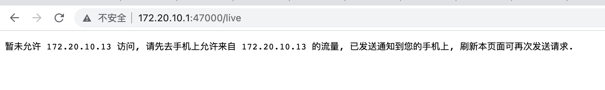
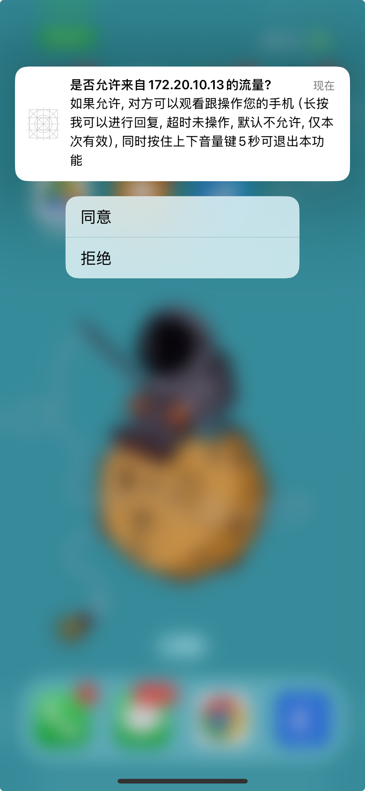
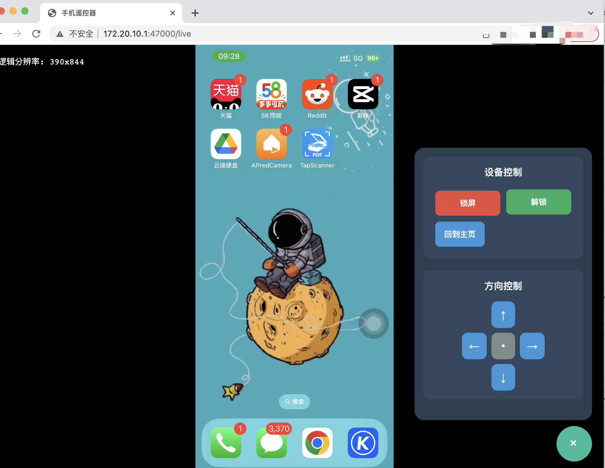

# WDA-Runner
UI自动化测试/局域网内控制iPhone测试
#使用说明：
####1.ipa包没有签名过，因为无法使用爱思助手等工具安装到iPhone上，会提示“安装包验证失败”类似错误
####2.签名工具可以自己写，也可以用我的resign.sh，经过测试，爱思助手的签名工具无法完整签名，没有经验的建议使用我的签名脚本，不过只有mac电脑可以执行，windows暂未研究，等楼主后续更新吧
####3.签名脚本需要改动2个地方
    ##12行：改为钥匙串中的名字
    ##16行：改为你的描述文件的名字（你问文件从哪来？可以闲鱼问问，有签名相关的一些卖家，正常大概13/14块钱），需要先安装到钥匙串方可继续签名（描述文件必须要一个 com.* 通配符的最好，有实力的可以自己改）
####4.试用版本目前只有一分钟，一分钟后会停止服务，需要授权才能使用
####5.本软件禁止用于非法用途！！！！！！！
####6.本软件参照的是WDA的自动化测试工具，相当于手机内部启动了一个服务器，浏览器可以通过访问手机的ip可以访问这个服务器
####7.访问地址  http://192.168.x.x:47000/live

####8.每次访问，App会弹出消息通知，提示是否允许来自客户端的访问，同意后方可访问

####9.目前网页版本还比较简单，一些简单的手势已实现，后续楼主会逐渐加入键盘等事件

####10.需要申请的权限: 网络权限、消息通知、本地网络
####11.待更新
