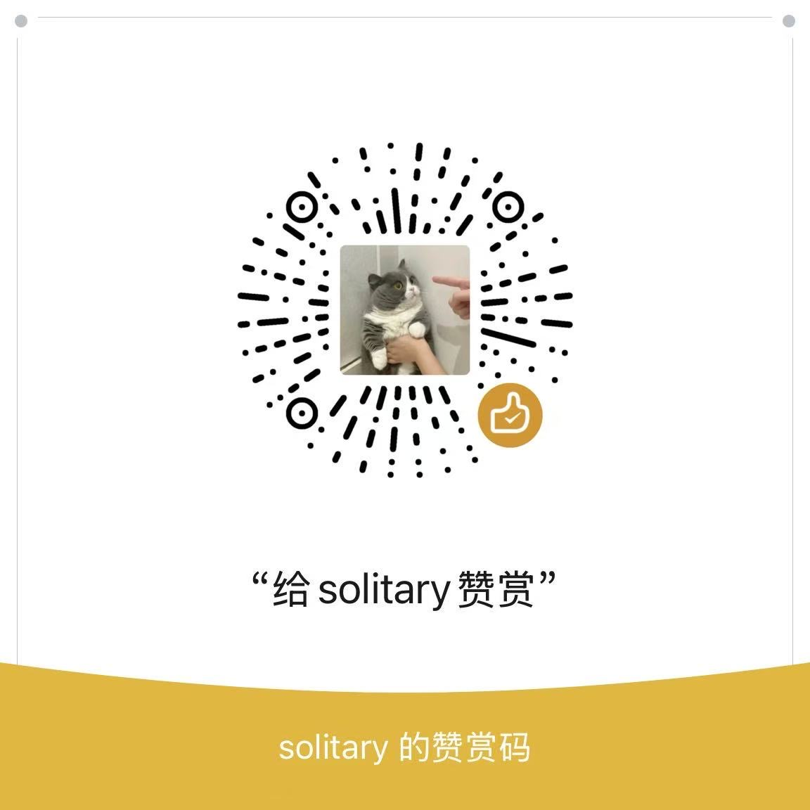

# 🚀 WDA-Runner 跨平台UI自动化测试工具

> **支持平台**: Windows、macOS、iPhone、Android、Ubuntu 等任何安装有浏览器的设备
> **iOS支持**: iOS15 ~ iOS26
> **功能**: UI自动化测试 / 局域网内控制iPhone测试

---

## 下载地址： https://github.com/ado2023-oss/WDA-Runner/releases/tag/1.3.5

## 📅 版本更新日志

### 2026年02月21日
- 沟通群：Q:418229151
- 授权码进群找私聊管理员

---

## 📖 使用指南

### ⚠️ 重要提示
## IPA包未签名，无法直接通过爱思助手等工具安装

## 巨魔玩家安装请使用 trollstore.ipa，或者使用url安装：https://raw.githubusercontent.com/ado2023-oss/WDA-Runner/refs/heads/main/trollstore.ipa
# 巨魔安装完App之后，启动App会闪退，请使用以上工具刷入【开发者镜像】！

## 赞赏

